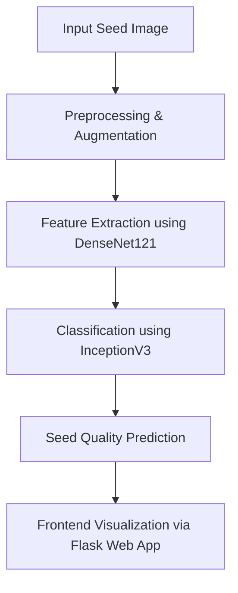

**“A Novel Approach to Enhance Crop Yield with Seed Quality Analysis and Machine Learning.”**

---

# 🌾 A Novel Approach to Enhance Crop Yield with Seed Quality Analysis and Machine Learning

## 📘 Overview

This project presents a **deep learning–based seed quality assessment system** that classifies soybean seeds into five quality categories — **Intact, Broken, Spotted, Immature, and Skin-Damaged**. The system integrates **DenseNet121** for feature extraction and **InceptionV3** for image classification, achieving high accuracy and efficiency.
By automating the seed grading process, this project aims to **enhance agricultural productivity, ensure sustainable farming**, and minimize human errors in manual inspection.

---

## 🚀 Key Features

* 🌱 **Automated Seed Quality Assessment** using CNN-based deep learning models.
* ⚡ **DenseNet121 + InceptionV3** architecture for accurate feature extraction and classification.
* 🧠 **Transfer Learning** and **Fine-Tuning** for improved model generalization.
* 💻 **Flask Web Application** for real-time seed image upload and classification.
* 📊 **Visualization Tools** for feature extraction, model performance, and confusion matrix.
* 🌍 **Sustainable Agriculture** through improved seed selection and crop yield optimization.

---

## 🧩 System Architecture

The proposed system follows a hybrid deep learning pipeline:

1. **Data Acquisition** – 5,513 soybean seed images categorized into 5 quality classes.
2. **Preprocessing** – Image cleaning, resizing (227×227 px), normalization, and augmentation.
3. **Feature Extraction** – Using DenseNet121 (pretrained on ImageNet).
4. **Classification** – Using InceptionV3 for multi-class prediction.
5. **Integration** – Flask backend and web-based frontend for user interaction.

  

---

## 🧠 Model Details

| Model                      | Accuracy | Precision | Recall  | F1-Score |
| -------------------------- | -------- | --------- | ------- | -------- |
| CNN                        | 81%      | 80%       | 80%     | 80%      |
| **DenseNet121**            | 88%      | 89%       | 88%     | 88%      |
| **InceptionV3 (Proposed)** | **92%**  | **91%**   | **90%** | **90%**  |
| EfficientNet               | 86%      | 87%       | 86%     | 89%      |
| ResNet                     | 88%      | 89%       | 88%     | 88%      |
| VGG19                      | 89%      | 89%       | 89%     | 89%      |

---

## 🧰 Tech Stack

**Languages & Frameworks**

* Python 3.7+
* TensorFlow / Keras
* Flask (for backend)
* HTML, CSS, JavaScript (for frontend)

**Libraries Used**

* NumPy, Pandas, Matplotlib
* Scikit-learn
* OpenCV
* Joblib

**Tools**

* Jupyter Notebook / VS Code
* Google Colab
* Git & GitHub

---

## 🖥️ System Requirements

**Hardware:**

* RAM: 8 GB or higher
* Processor: Intel i5 / i7 or equivalent
* Storage: 500 GB or above
* OS: Windows 10/11, macOS, or Linux

**Software:**

* Python 3.7+
* TensorFlow 2.x / PyTorch
* Flask
* OpenCV, NumPy, Pandas

---

## ⚙️ Project Workflow

## 📸 Sample Outputs

**1️⃣ Web Interface**

  

**2️⃣ Classification Result**

  

**3️⃣ Confusion Matrix**

  

---

## 🔬 Testing

The project underwent several test cases to ensure accuracy and robustness:

| Test ID | Test Case          | Description                              | Result |
| ------- | ------------------ | ---------------------------------------- | ------ |
| TC01    | Data Preprocessing | Validate image cleaning and augmentation | ✅ Pass |
| TC02    | Data Normalization | Verify pixel value scaling               | ✅ Pass |
| TC03    | Feature Extraction | Extract valid feature vectors            | ✅ Pass |
| TC04    | Classification     | Test accuracy of model                   | ✅ Pass |
| TC05    | Integration        | Test frontend-backend interaction        | ✅ Pass |

---

## 📈 Results

* Achieved **92% classification accuracy** using DenseNet + InceptionV3.
* Improved precision and recall over traditional CNNs.
* Real-time seed quality prediction in less than 2 seconds per image.
* Enhanced decision-making for farmers and agronomists.

---

## 🔮 Future Work

* Extend the model to other crop species.
* Integrate with IoT-based soil and weather monitoring systems.
* Develop a mobile-friendly version for on-field use.
* Incorporate ensemble deep learning and cloud-based deployment.

---

## 📚 References

Based on works cited in:

* Global Food Security (2021)
* IEEE Transactions on Computer and Social Systems (2021)
* Sensors Journal (2020)
* Computer and Electronics in Agriculture (2019)
* ISPACS Conference Proceedings (2011)

---

## 🏁 Conclusion

This project demonstrates how **machine learning and computer vision** can transform traditional agriculture by automating **seed quality evaluation**, improving **crop yield**, and promoting **sustainable farming practices**. Through transfer learning and integration of deep CNNs, it bridges the gap between technology and real-world agricultural challenges.

---

Would you like me to **generate a ready-to-upload `README.md` file** (formatted with markdown and including your GitHub repo name placeholders)? I can also add badges (like Python, TensorFlow, Flask, License) and a “Project Demo” section if you plan to upload screenshots or videos.
